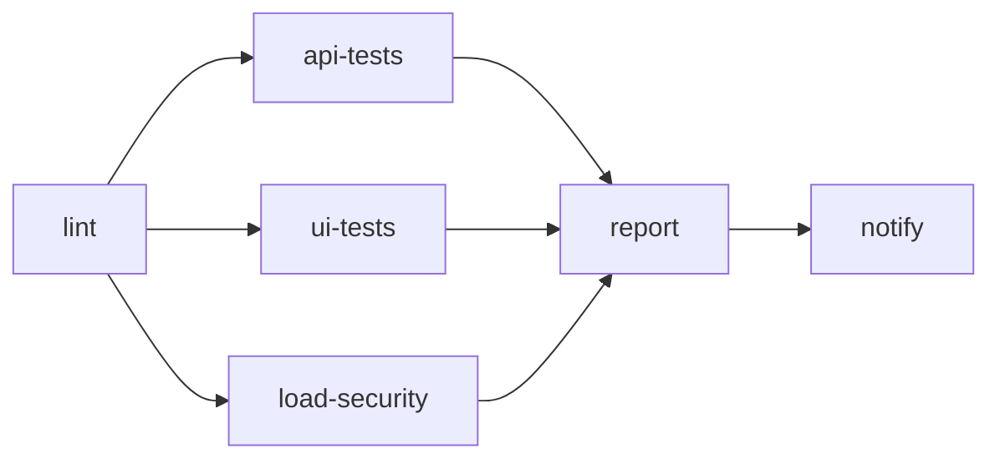

# Conduit Test Lab

[](https://github.com/ArtyomZabello/Myportfolio/actions/workflows/main.yml)
[](https://www.python.org/downloads/)
[](https://artyomzabello.github.io/Myportfolio/)

Pet-проект по автоматизации тестирования. Проверяю [Conduit (RealWorld API)](https://github.com/gothinkster/realworld) на нескольких уровнях и прогоняю всё через GitHub Actions.

> English version — [below](#english)

## Отчёты

После прогона на `main` обновляются четыре отчёта на GitHub Pages:

- [Функционал (Allure)](https://artyomzabello.github.io/Myportfolio/)
- [Нагрузка (Locust)](https://artyomzabello.github.io/Myportfolio/locust_report.html)
- [Security (API Scan)](https://artyomzabello.github.io/Myportfolio/zap_api_report.html)
- [Security (Baseline)](https://artyomzabello.github.io/Myportfolio/zap_baseline_report.html)

---

## Что проверяется

- **API** — регистрация, логин, статьи, комментарии, теги (`pytest`, `httpx`)
- **UI** — логин и базовые сценарии (`Playwright`, заглушка интерфейса на `:4200`)
- **Нагрузка** — короткий smoke-тест на Locust с проверкой p95
- **Security** — OWASP ZAP: baseline и OpenAPI scan

## Как работает CI

Процесс описан в [`.github/workflows/main.yml`](.github/workflows/main.yml).

Сначала **lint** (`ruff`, `mypy`). Если ок — три задачи идут **параллельно**:

- **api-tests** — поднимает тестируемую систему в Docker, гоняет API-тесты
- **ui-tests** — Playwright в контейнере, заглушка интерфейса на `:4200`
- **load-security** — свой Docker, подготовка данных → Locust → ZAP

После тестов **report** скачивает Allure-отчёты из всех задач, собирает общий отчёт и выкладывает на Pages (только push в `main`). **notify** шлёт ссылки в Telegram.



## Основные идеи

- API, UI, нагрузка и security — отдельные задачи, не один длинный прогон
- API и нагрузка поднимают **свою** тестируемую систему в Docker и не делят базу
- Нагрузочные данные фиксированы (`performance/datasets/load_v1.json`), перед Locust — шаг verify
- Отчёты из параллельных задач склеиваются в одной задаче report

Pet-проект для портфолио: показать, как собрать многослойную автоматизацию без одной тяжёлой CI-задачи.

## Технологии

Python 3.12 · pytest · httpx · Pydantic · Playwright · Locust · OWASP ZAP · Allure · Docker Compose · GitHub Actions · Ruff · Mypy · Faker

## Запуск локально

**Установка**

```bash
git clone https://github.com/ArtyomZabello/Myportfolio.git
cd Myportfolio
pip install -e ".[dev]"
playwright install chromium   # для UI-тестов
cp .env.example .env
```

**API**

```bash
docker compose -f app/docker-compose.yml up -d --build
python scripts/wait_for_backend.py
pytest tests/api/ -m "not demo" -v
docker compose -f app/docker-compose.yml down -v
```

**UI**

```bash
python scripts/mock_conduit_ui_server.py &
python scripts/wait_for_ui.py
pytest tests/ui/ -m "not demo" -v
```

**Нагрузка**

```bash
docker compose -f app/docker-compose.yml up -d --build
python scripts/wait_for_backend.py
python performance/seed_load_data.py verify
locust -f performance/locustfile.py --headless -u 10 -r 5 --run-time 30s \
  --host http://localhost:8000/api --html performance/locust_report.html
python scripts/check_locust_thresholds.py
docker compose -f app/docker-compose.yml down -v
```

**Allure локально:** `allure serve allure-results`

**Makefile (Linux / WSL):** `make env` → `make up` → `make test-api` → `make down`

---
---

# English

# Conduit Test Lab

Pet-project for test automation. I test the [Conduit (RealWorld API)](https://github.com/gothinkster/realworld) at several levels and run everything through GitHub Actions.

## Reports

After a run on `main`, four reports are published on GitHub Pages:

- [Functional (Allure)](https://artyomzabello.github.io/Myportfolio/)
- [Load (Locust)](https://artyomzabello.github.io/Myportfolio/locust_report.html)
- [Security (API Scan)](https://artyomzabello.github.io/Myportfolio/zap_api_report.html)
- [Security (Baseline)](https://artyomzabello.github.io/Myportfolio/zap_baseline_report.html)

---

## What's tested

- **API** — registration, login, articles, comments, tags (`pytest`, `httpx`)
- **UI** — login and basic flows (`Playwright`, UI stub on `:4200`)
- **Load** — short Locust smoke test with p95 check
- **Security** — OWASP ZAP: baseline and OpenAPI scan

## How CI works

The workflow is in [`.github/workflows/main.yml`](.github/workflows/main.yml).

First **lint** (`ruff`, `mypy`). If it passes, three jobs run **in parallel**:

- **api-tests** — starts the system under test in Docker, runs API tests
- **ui-tests** — Playwright in a container, UI stub on `:4200`
- **load-security** — its own Docker stack, data prep → Locust → ZAP

Then **report** downloads Allure results from all jobs, merges them, and deploys to Pages (push to `main` only). **notify** sends links to Telegram.


## Main ideas

- API, UI, load, and security are separate jobs, not one long run
- API and load each start **their own** system under test in Docker — no shared database
- Load data is fixed (`performance/datasets/load_v1.json`), with a verify step before Locust
- Results from parallel jobs are merged in one report job

A portfolio pet-project: show how to build multi-layer automation without one heavy CI job.

## Technologies

Python 3.12 · pytest · httpx · Pydantic · Playwright · Locust · OWASP ZAP · Allure · Docker Compose · GitHub Actions · Ruff · Mypy · Faker

## Running locally

**Setup**

```bash
git clone https://github.com/ArtyomZabello/Myportfolio.git
cd Myportfolio
pip install -e ".[dev]"
playwright install chromium   # for UI tests
cp .env.example .env
```

**API**

```bash
docker compose -f app/docker-compose.yml up -d --build
python scripts/wait_for_backend.py
pytest tests/api/ -m "not demo" -v
docker compose -f app/docker-compose.yml down -v
```

**UI**

```bash
python scripts/mock_conduit_ui_server.py &
python scripts/wait_for_ui.py
pytest tests/ui/ -m "not demo" -v
```

**Load**

```bash
docker compose -f app/docker-compose.yml up -d --build
python scripts/wait_for_backend.py
python performance/seed_load_data.py verify
locust -f performance/locustfile.py --headless -u 10 -r 5 --run-time 30s \
  --host http://localhost:8000/api --html performance/locust_report.html
python scripts/check_locust_thresholds.py
docker compose -f app/docker-compose.yml down -v
```

**Allure locally:** `allure serve allure-results`

**Makefile (Linux / WSL):** `make env` → `make up` → `make test-api` → `make down`
